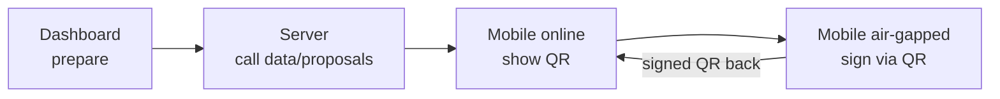

**Sovereign bond tokenization infrastructure for emerging markets**

Clad Sovereign provides compliance-first tokenization infrastructure for finance ministries, debt offices, and state issuers in emerging markets. Built on Substrate/Polkadot for full operational sovereignty.

**Repositories:**
   - `clad-studio` — Open-source Substrate pallet and node
   - `clad-dashboard` — Read-only monitoring dashboard
   - `clad-mobile` — Native mobile signer (private)

**Signing Architecture:**

  - Keys never leave device or touch network
  - All signatures air-gapped
  - Mobile-to-mobile QR only
  - Dashboard = monitoring + batch prep

*[Watch 60-second demo – November 2025](https://www.loom.com/share/dd334230db154f9891f46664ae02aec4)*  
\
_(Initial demo shows native iOS/Android biometric connection + live block stream.)_
